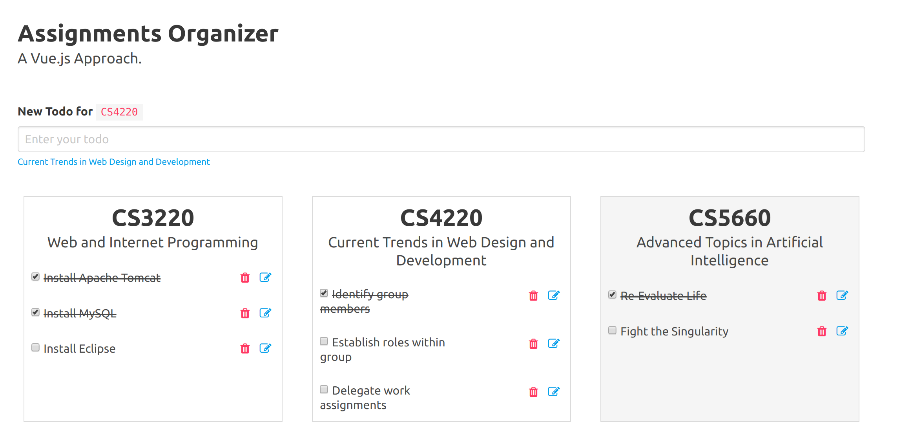

# Todo List(can add, edit, delete)
## What I do
1.use vue framework and its components

2.styling app by bulma css framework (link here:https://github.com/jgthms/bulma)

3.change the label when you click one of course
## How to run
npm run dev under course directory

